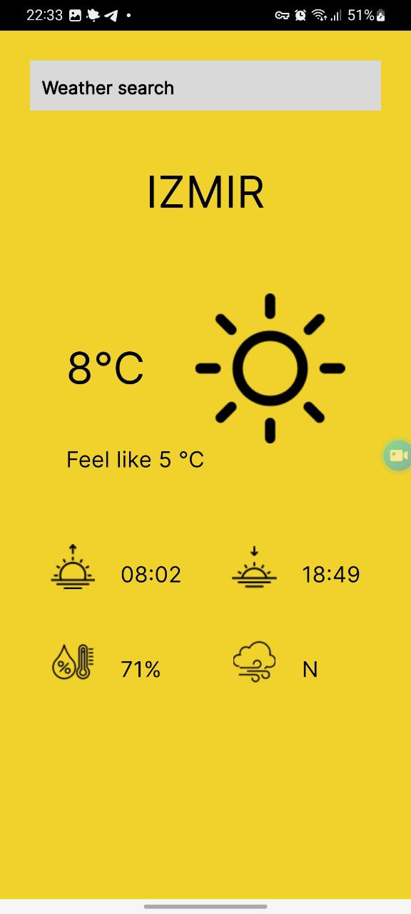
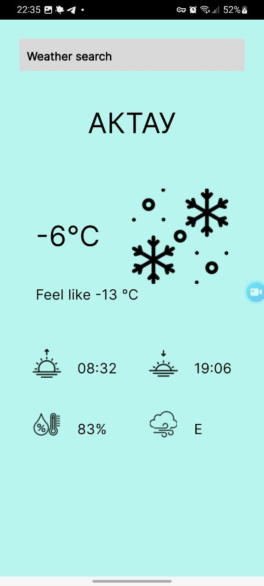

# Weather_app

Мобильное приложение для получения данных о погоде.

    
    
    

    
    
    
    

## Описание:

Реализованы
- интерфейс экранов регистрации и авторизации, экрана отображения погоды по макету Figma;
- локальное хранение данных (shared_preferences);
- взаимодействие с API OpenWeatherMap (http);
- определение геолокации и названия города по координатам (geolocator, geocoding);
- форматирование времени и направления ветра (intl);

## Платформа:

Android
